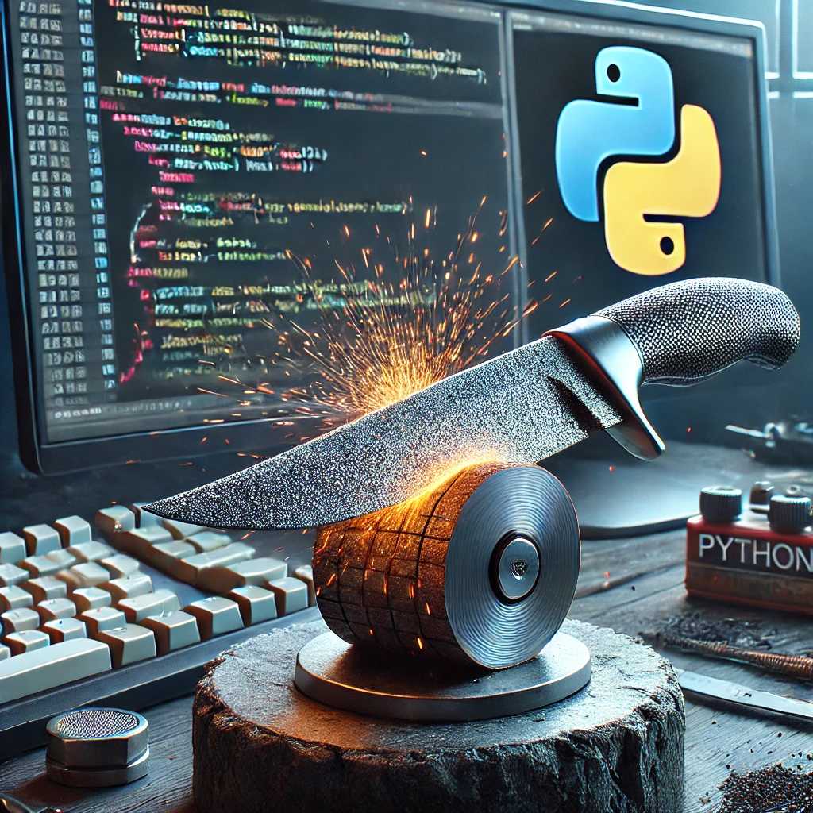

# Skill Sharpening Python - Part 1



This repo allows you to practice the basics of Python that you have just learned. Albeit tedious, it is good to understand the basics before you jump to more difficult concepts. This allows you to become a stronger developer. 

Before you start, make sure you create your virtual environment.

```
python3 -m venv .venv
source .venv/bin/activate
```
Choose 'yes' when prompted to include the venv in your workspace.

Remember to choose install when prompted to install the `ipykernel` package.

